# Senegal Banques
### Here is a list of all Banques in Senegal.

|               Logo               |                                    Name                                    |                            Location                            |              email               |                   website                   |            phone             |
|:--------------------------------:|:--------------------------------------------------------------------------:|:--------------------------------------------------------------:|:--------------------------------:|:-------------------------------------------:|:----------------------------:|
|        |                            `Attijariwafa Bank`                             |    31, Avenue Léopold Sédar Senghor – BP 32 003 Dakar Ponty    |                -                 |     https://www.attijariwafabank.com/fr     | 221338899898 -  221338234857 |
|  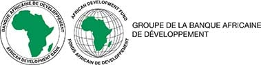  |                 `Banque Africaine de Développement (BAD)`                  |                               -                                |                -                 |           https://www.afdb.org/fr           |              -               |
|  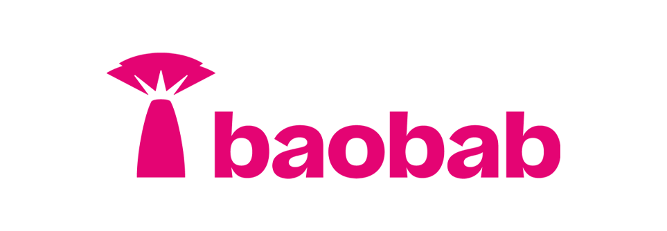   |                              `Baobap Crédit`                               |                         Dakar, Senegal                         |                -                 |           https://baobab.com/sn/            |              -               |
|  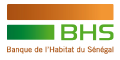  |                   `Banque de l'Habitat du Sénégal (BHS)`                   |      Boulevard Général De Gaulle / B.P 229 Dakar Sénégal       |                -                 |             https://www.bhs.sn/             |         221338393333         |
|  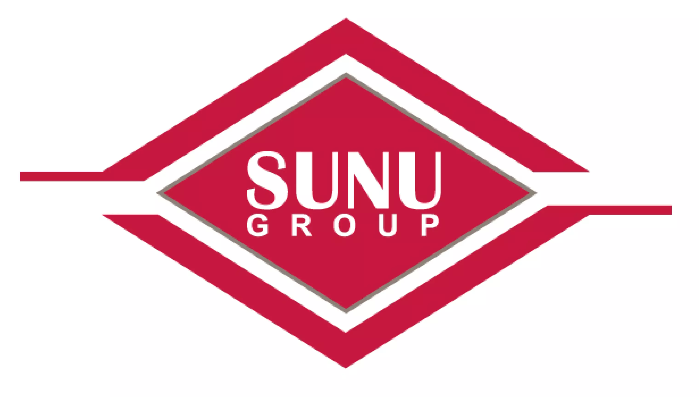  | `Banque Internationale pour le Commerce et l'Industrie au Sénégal (BICIS)` |                         Dakar Sénégal                          |       bicis@sunubicis.com        |           https://sunubicis.com/            |    338390390 - 338234721     |
|  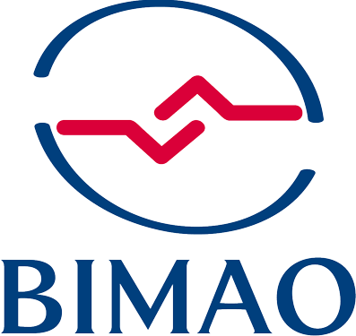  |     `Banque des Institutions Mutualistes d'Afrique de l'Ouest (BIMAO)`     |   Sacré-Coeur 3 Pyrotechnie VDN 15098 - CP 12524 Dakar-Fann    |        ebanking@bimao.sn         |  https://ebanking.bimao.sn/PortailWeb/#!/   |         221338598218         |
|  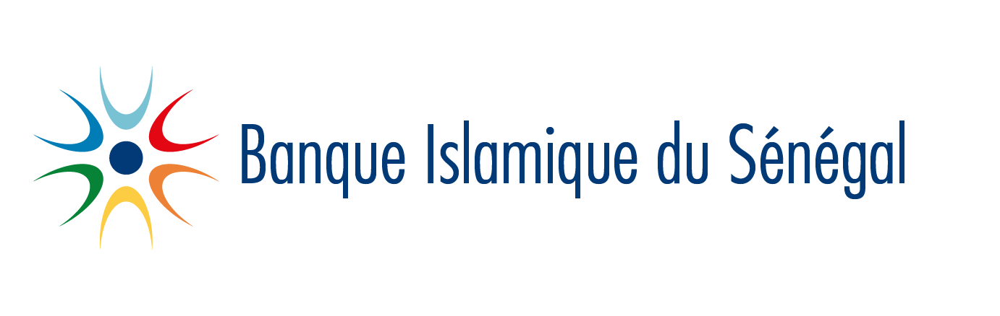  |                    `Banque Islamique du Sénégal (BIS)`                     | Almadies niveau rond-point, face route King FAH, Dakar-Sénégal |       contact@bis-bank.sn        |            https://bis-bank.com/            | 221338496262 - 221338224948  |
|  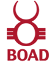  |               `Bank Ouest Africaine de Développement (BOAD)`               |                         BP 1992 Dakar                          |                -                 |            https://www.boad.org/            |    338496240 - 338421667     |
|  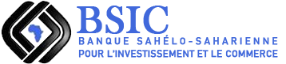  |  ` Banque Sahelo Saharienne pour l'Investissement et le Commerce (BSIC)`   |                               -                                |                -                 |          https://bsicbank.com/eng/          |    338895858 - 338427105     |
|  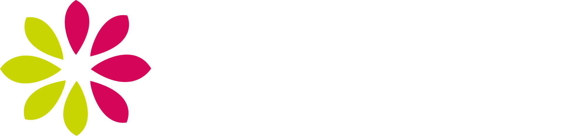  |          `Caisse Nationale de Crédit Agricole du Sénégal (CNCAS)`          |     Place de l’Indépendance, ancien immeuble d’Air Afrique     |         cncas@cncas.sn           |      https://www.labanqueagricole.sn/       |    338393636 - 338212606     |
|  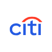  |                             `Citibank Sénégal`                             |                    MH99+J2C, Dakar, Senegal                    |    salimata.boye@citicorp.com    |            https://www.citi.com/            |    338491111 - 338238817     |
|        |            `Compagnie Bancaire de l'Afrique Occidentale (CBAO)`            |            place de l'indépendance - Dakar, Sénégal            |                -                 |          https://www.cbaobank.com           |         221338496060         |
|     |                     `Crédit Mutuelle du Sénégal (CMS)`                     |       Point E 17 Rue de Fatick BP: 28052 Dakar Sénégal         |          contact@cms.sn          |             https://www.cms.sn/             |         221338694848         |
|  |                             `Ecobank Senegal`                              |                     Mermoz, Dakar, Sénégal                     |   ecobankenquiries@ecobank.com   | https://www.ecobank.com/sn/personal-banking |         221338492300         |
|  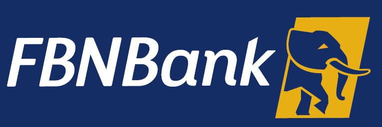   |                             `FBNBank Senegal`                              |       Dakar, Routes de Almadies Zone 15 Lot D, BP 11045        | serviceclient@fbnbanksenegal.com |       https://www.fbnbanksenegal.com/       |         221338598010         |
| 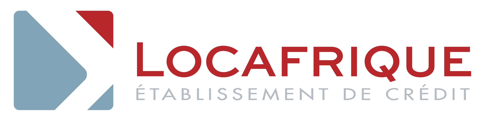  |                                `LOCAFRIQUE`                                |               Route de Ngor X Route des Almadies               |                -                 |       https://www.locafrique-sf.com/        |         221338592760         |
|     |                             `Orabank Senegal`                              |                         Dakar, Senegal                         |                -                 | https://www.orabank.net/fr/filiale/senegal  |              -               |
|  |               `Société Général de Banque au Sénégal (SGBS)`                |              Avenue Léopold Sédar Senghor à Dakar              |                -                 |       https://societegenerale.sn/fr/        | 221338395500 - 221338394242  |
|  |                       `United Bank of Africa  (UBA)`                       |       Route des Almadies Zone 12 Lot D , Dakar, Sénégal        |     cfcsenegal@ubagroup.com      |         https://www.ubasenegal.com/         | 221338595100 - 221338206010  |